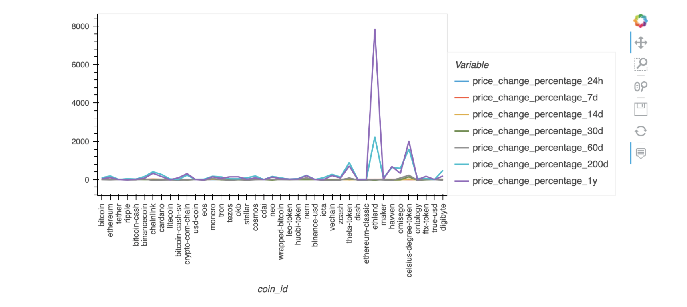
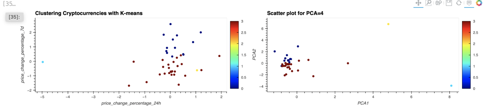

# Crypto-Clustering

This repo is uses a CSV file data for analysis (in the Resources folder). It use the K-Means algorithm on scaled data and applies the Principal component analysis
algorithm to create clusters for this data. At the end we have two methods compared.

---

## Technologies

JupyterLab web application

This project leverages python 3.7 with the following packages:

* pathlib
* pandas
* hvplot
* sklearn

---

## Usage

To use the Crypto-Clustering clone the repository, open it with Jupyterlab and run the 

    * crypto_investments.ipynb

The multiple feature data looks like this:

The clustering  of the data using two methods:

## Contributors

    Nara Arakelyan
---
## License

UC Berkley

